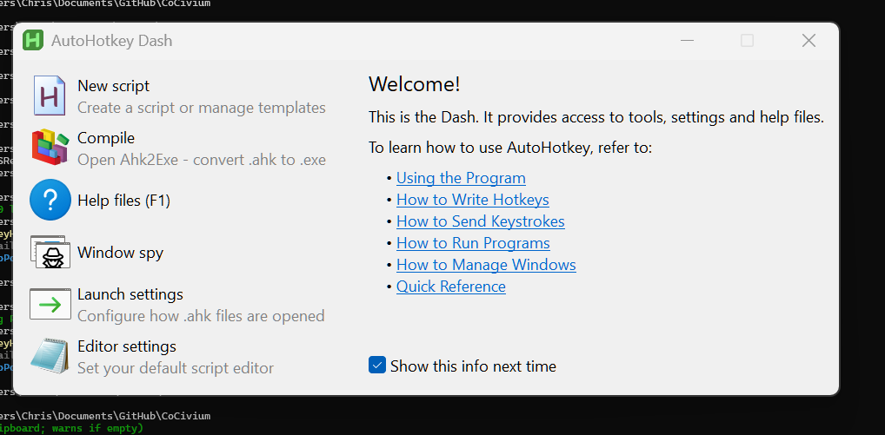

# FTW multi-panel workspace (pre-CoAgent)

This pattern uses a 3-panel browser layout with **4 concurrent PS7 sessions** in the center column.
CoPingPong moves content via **CoTemps** for fast handoff across windows. *(Great pre-CoAgent, or if you prefer bare-metal.)*

## Key ideas
- Left/right columns: chat, notes, status.
- Middle: one PS7 tab per stream; long runs isolated.
- CoPingPong hotkeys push/pull via **CoTemps**.
- Plays nicely with DO-GUARD and BPOE capture.
## Hotkeys & Pairing (pre-CoAgent)
- **Help anywhere:** Ctrl+Alt+H ? opens quick-help (AHK ? DO-ShowHelp.ps1)
- **Trigger (focused):** Ctrl+Alt+Enter ? drops *context* trigger (DO-CoKey.ps1)
- **Trigger (omni):** Ctrl+Alt+Shift+Enter ? drops *omni* trigger
- **Pair chat ? panel:** DO-CoPairChat.ps1 (AHK) + DO-CoPairPanel.ps1
- Queue files in CoTemps\queue\* for watchers.
